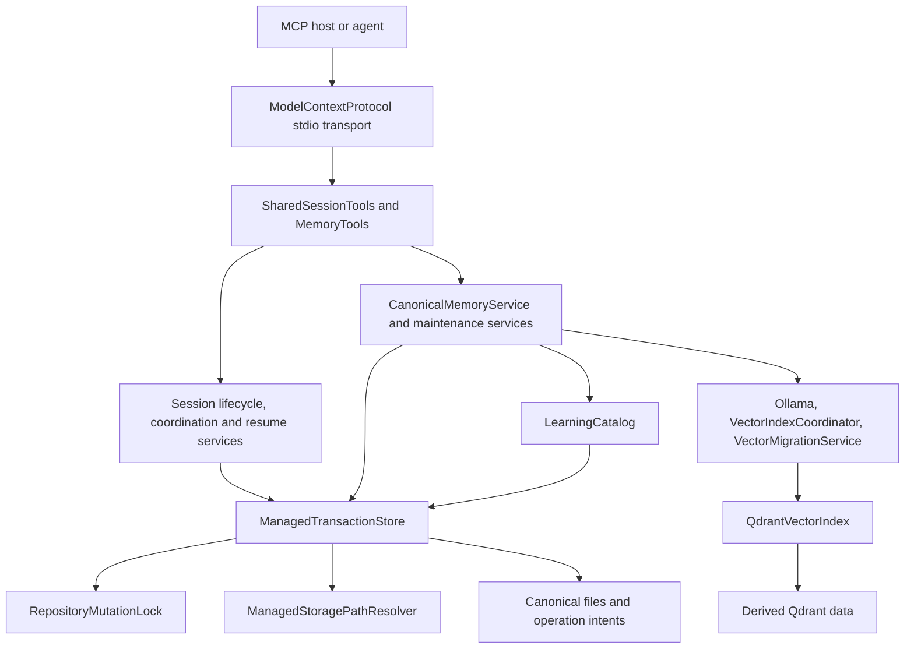
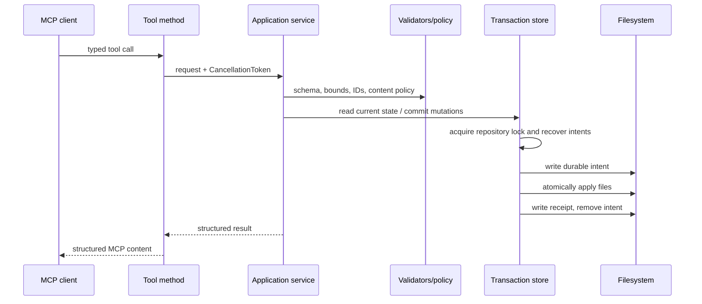

# Solution architecture

[Previous: Purpose](01-purpose-users-and-product-intent.md) | [Developer wiki](README.md) | [Next: Startup and configuration](03-startup-configuration-and-dependency-injection.md)

## Project structure

| Project | Responsibility |
| --- | --- |
| [AgentSession.MCP](../../AgentSession.MCP/) | Production stdio server, tools, contracts, domain models and services |
| [AgentSession.MCP.Tests](../../AgentSession.MCP.Tests/) | Unit, integration, protocol, process, concurrency and live semantic tests |
| [AgentSession.MCP.TestWorker](../../AgentSession.MCP.TestWorker/) | Separate process used to verify cross-process locking and crash/recovery behavior |

## Layered view

## Request lifecycle

Tool classes translate validation and storage exceptions into stable MCP errors. Business behavior remains in services.

## Canonical versus derived state

Canonical state includes:

- session coordination metadata, artifacts and snapshot/checkpoint data;
- temp, short and long memory records;
- outcomes, events, archive manifests and transaction receipts;
- pending vector work and active migration metadata.

Derived state includes:

- sharded `LearningCatalog` indexes;
- Qdrant points and payload indexes;
- embedding vectors.

`LearningCatalog.RebuildAsync` reconstructs filesystem indexes from canonical records. `VectorMigrationService.MigrateAsync` reconstructs a compatible Qdrant collection. This makes vector-provider or database migration possible without losing source text and provenance.

## Deployment model

The production project is a single-process .NET Generic Host with stdio transport. One process binds one repository ID and central root. Singleton services share one configuration and one repository lock. `MemoryMaintenanceService` runs bounded background work on the host lifetime.

## Key source entry points

- [Program.cs](../../AgentSession.MCP/Program.cs) composes the process.
- [MemoryConfigurationExtensions.cs](../../AgentSession.MCP/Extensions/MemoryConfigurationExtensions.cs) registers and validates services/options.
- [SharedSessionTools.cs](../../AgentSession.MCP/Tools/SharedSessionTools.cs) exposes six session tools.
- [MemoryTools.cs](../../AgentSession.MCP/Tools/MemoryTools.cs) exposes twenty memory tools.
- [ManagedTransactionStore.cs](../../AgentSession.MCP/Services/ManagedTransactionStore.cs) owns durable multi-file commits.
- [CanonicalMemoryService.cs](../../AgentSession.MCP/Services/CanonicalMemoryService.cs) owns canonical memory behavior across partial-class files.

