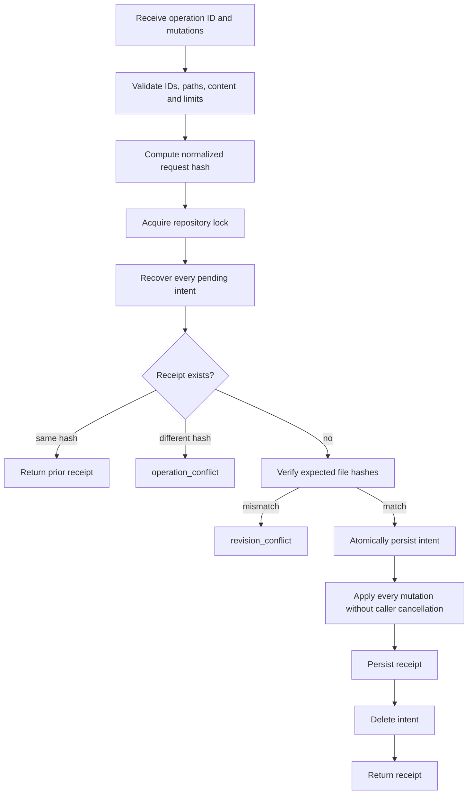

# Storage, concurrency and recoverable transactions

[Previous: Startup](03-startup-configuration-and-dependency-injection.md) | [Developer wiki](README.md) | [Next: Session tool flows](05-session-tool-flows.md)

## Central storage layout

`MemoryStoragePaths` derives fixed roots from validated startup configuration:

```text
<system-root>/
  sessions/<repository-id>/<session-id>/coordination/
  repositories/<repository-id>/AiLearning/
  .vector/qdrant/
  .locks/<repository-id>.lock
  .authorizations/<repository-id>/
```

Sessions and learning are repository isolated. Qdrant data and locks are central infrastructure. Operator grants are read-only authority inputs outside managed writable areas.

## Path safety

`ManagedStoragePathResolver` accepts server-generated relative components only. It verifies the bound repository, safe lowercase identifiers, invalid characters, path containment and every ancestor for links or Windows reparse points. Resolution is repeated immediately before operations because the filesystem can change after earlier validation.

This is a containment mechanism for a trusted local filesystem owner, not an operating-system sandbox.

## Repository lock

`RepositoryMutationLock.AcquireAsync` combines:

- an in-process `SemaphoreSlim`;
- an exclusive OS file handle opened with `FileShare.None`;
- a bounded timeout and caller cancellation.

The combination serializes mutation/recovery across threads and server processes using the same repository identity. A timeout becomes the stable `lock_timeout` tool error.

## Atomic single-file write

`SystemFileSystem.WriteAtomicAsync` writes a unique temp file with write-through, flushes managed and OS buffers, then replaces or moves it into place. Failed staging files are deleted. UTF-8 encoding rejects malformed input rather than inserting replacement characters.

## Roll-forward multi-file commit

`ManagedTransactionStore.CommitAsync` is the durability core.



The durable intent is the commit decision. Cancellation before the intent aborts; after it, recovery must finish. Every reader acquires the same lock and calls recovery before observing managed state, so readers do not see a permanently half-applied transaction.

## Optimistic concurrency

Services convert record revisions into expected file hashes. The transaction store compares those hashes immediately before intent creation. A stale caller gets `revision_conflict` without a silent overwrite.

Operation receipts provide idempotency. Reusing an operation ID with identical mutation content returns the original result. Reusing it for different content returns `operation_conflict`.

## Learning catalog

`LearningCatalog` stores a manifest plus hash-verified shards selected from the memory ID. It indexes tier, status, path, revision, content hash, deduplication scope, timestamps and session. If derived data is malformed or inconsistent, `ReadAsync` rebuilds it from canonical records. Invalid canonical files are reported rather than deleted.

## Design consequence

New code must not bypass `ManagedTransactionStore` for managed session or learning writes. Direct writes would break locking, recovery, content policy, revision checks and idempotency.

