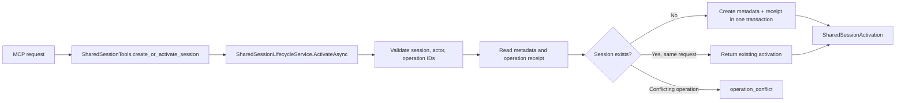
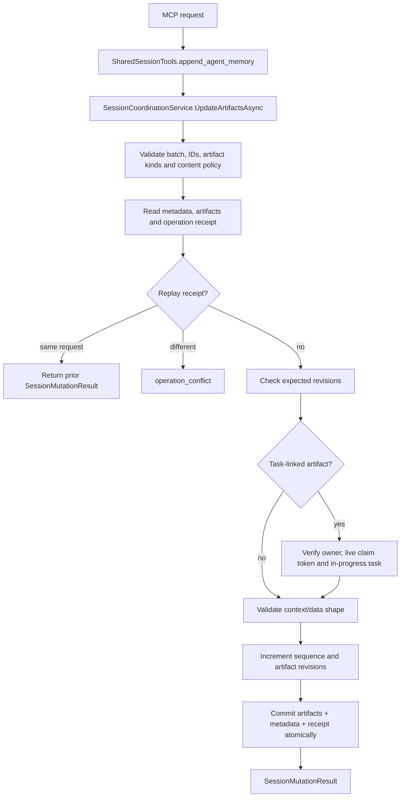
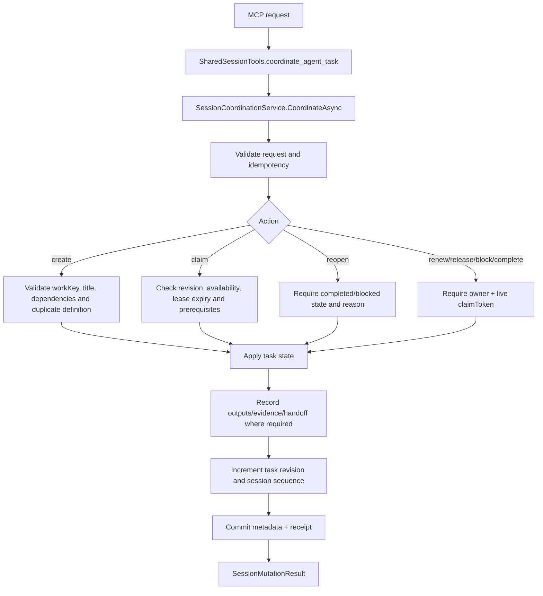
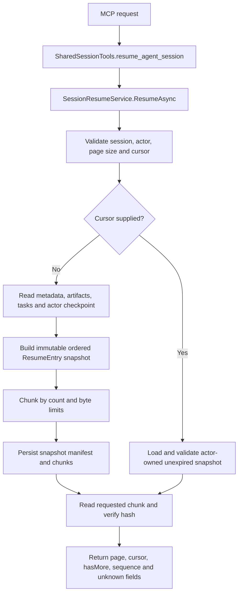
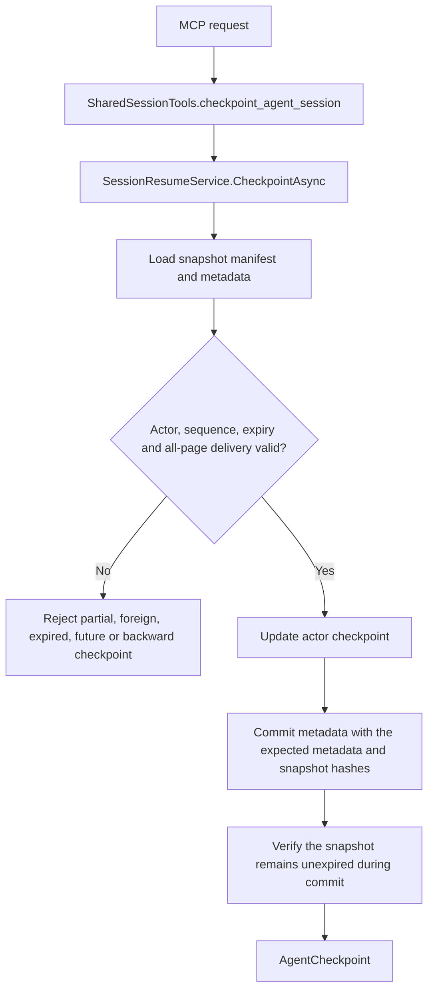

# Session tool end-to-end flows

[Previous: Storage](04-storage-concurrency-and-transactions.md) | [Developer wiki](README.md) | [Next: Core memory tools](06-core-memory-tool-flows.md)

The six tools in `SharedSessionTools` catch domain validation, timeout and invalid-storage errors and expose stable MCP errors. They delegate all behavior to session services.

## `create_or_activate_session`

Activation returns identity and current sequence. It does not load artifacts.

## `list_agent_sessions`

```mermaid
flowchart LR
    A[MCP request] --> B[SharedSessionTools.list_agent_sessions]
    B --> C[SharedSessionLifecycleService.ListAsync]
    C --> D[Validate pageSize and after]
    D --> E[ManagedTransactionStore.ListSessionIdsAsync]
    E --> F[Lock + recover pending intents]
    F --> G[Enumerate safe session directories with metadata]
    G --> H[Sort, bound, calculate hasMore/after]
    H --> I[SharedSessionList]
```

Only IDs are returned; clients resume a selected session separately.

## `append_agent_memory`

The service reserves task state from generic artifact writes. Artifact updates replace the complete representation.

## `coordinate_agent_task`

Claims use server time, expiry and fencing generation. Completion evidence is caller-reported; the server does not run the verification.

## `resume_agent_session`

Later concurrent commits are excluded from the current immutable snapshot and appear in the next resume.

## `checkpoint_agent_session`

Checkpointing acknowledges consumption; it saves no work content.

## Session data files

`SessionCoordinationService` and `SessionResumeService` use managed files below the session's `coordination` directory for metadata, artifacts, operation receipts, snapshot manifests and chunks. Exact names are server-owned and must not be constructed by clients.
