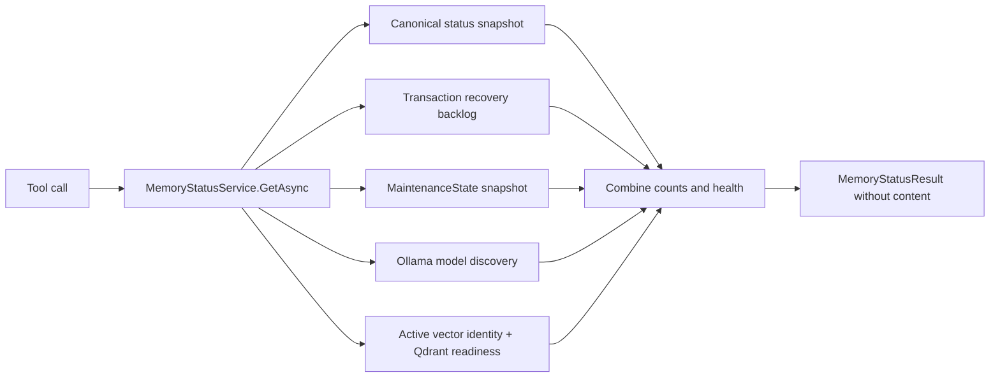
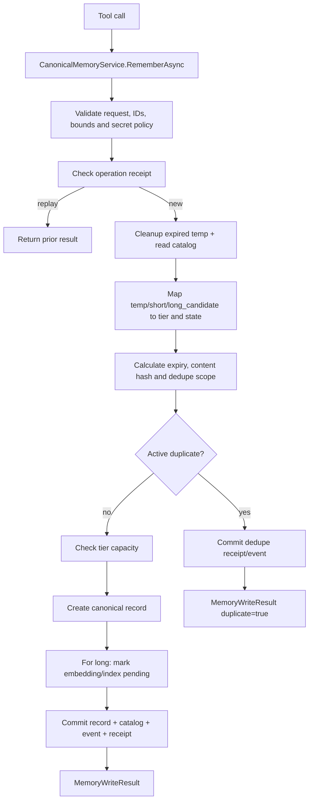
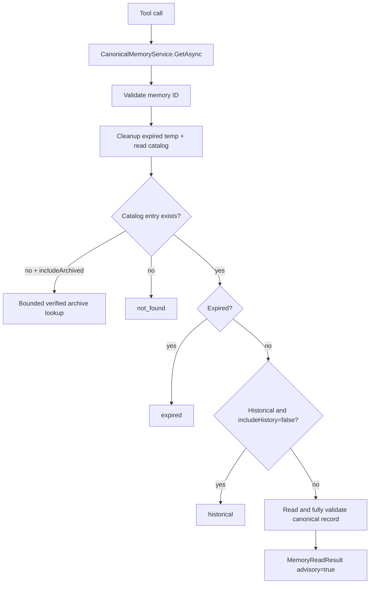
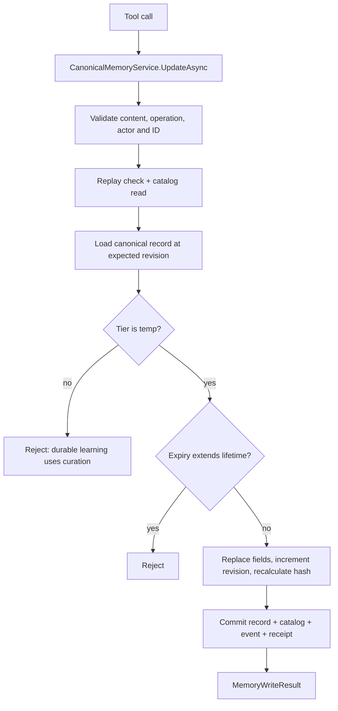
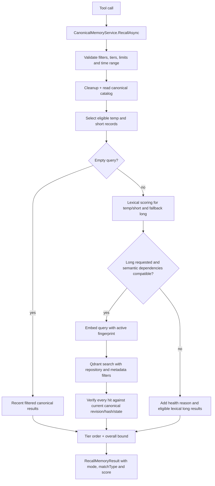

# Core memory tool end-to-end flows

[Previous: Session tools](05-session-tool-flows.md) | [Developer wiki](README.md) | [Next: Curation tools](07-curation-tool-flows.md)

These tools enter through `MemoryTools`. Canonical behavior is owned by `CanonicalMemoryService`; search also uses `OllamaEmbeddingClient`, `VectorMigrationService` and `QdrantVectorIndex`.

## `memory_status`

Dependency failures become structured degraded states rather than destroying canonical data.

## `memory_remember`

Deduplication uses normalized content plus structured data and a scope containing repository, tier, category, decision area and temp session.

## `memory_get`

Canonical validation compares identity, path, revision, state, timestamps and hashes with the catalog entry.

## `memory_update`

Creation time is preserved. Temp expiry can only stay the same or shorten.

## `memory_recall`

Qdrant hits never bypass canonical verification. Retired, superseded, contradicted and candidate records require explicit historical flags.

