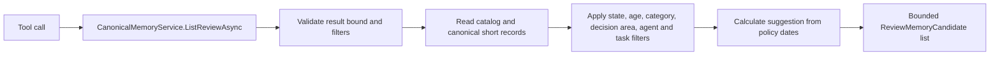
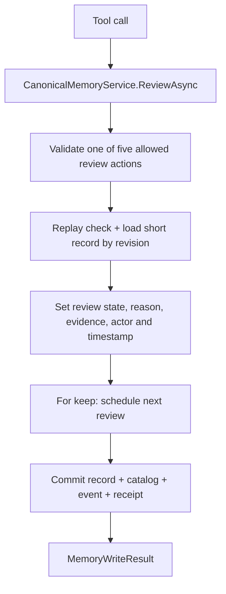
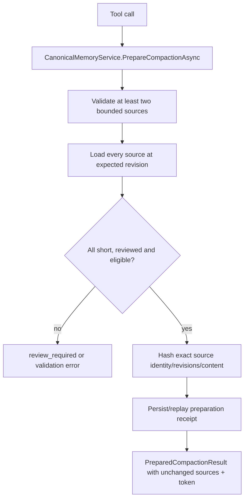
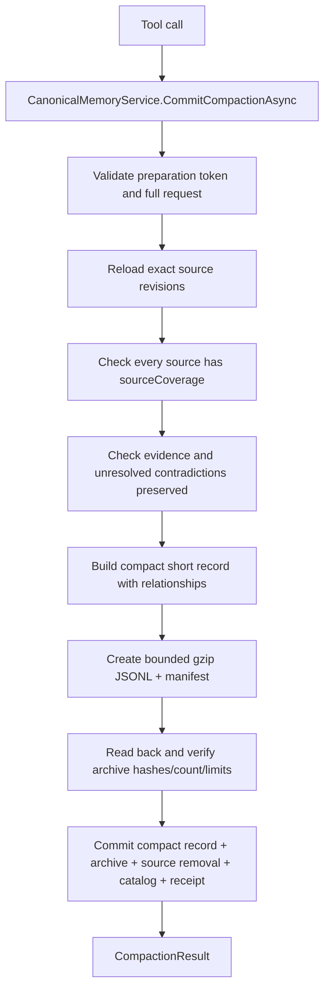
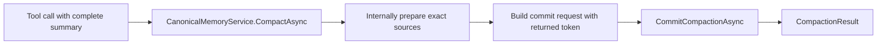
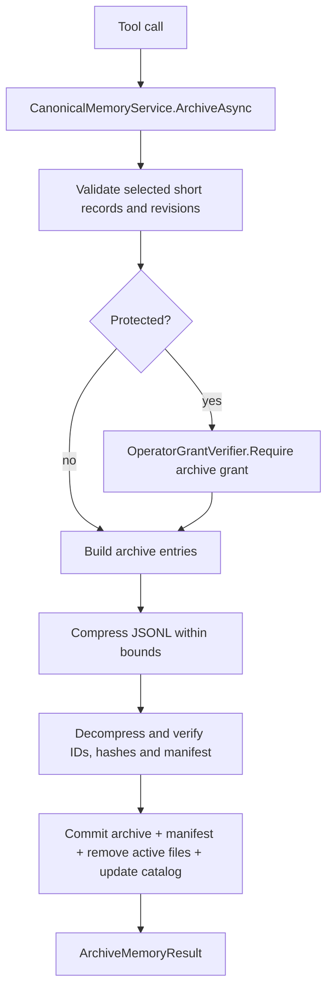
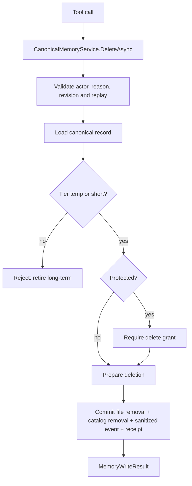

# Curation tool end-to-end flows

[Previous: Core memory](06-core-memory-tool-flows.md) | [Developer wiki](README.md) | [Next: Lifecycle tools](08-learning-lifecycle-tool-flows.md)

## `memory_list_review`

Suggestions are not approval.

## `memory_mark_reviewed`

The five actions are keep, compact candidate, promotion candidate, archive candidate and delete candidate. No lifecycle action is performed here.

## `memory_prepare_compaction`

## `memory_commit_compaction`

The server validates structural coverage, not semantic truth.

## `memory_compact`

This convenience path is appropriate only when the caller already reviewed every source.

## `memory_archive`

Source removal never precedes verified archive construction.

## `memory_delete`

Deletion events omit raw deleted content.

## Compaction data model

`CompactionDetails` stores source IDs, summary, facts, questions, contradictions, patterns, evidence and per-source coverage. Relationships connect compacted output back to sources. Archives remain explicitly readable with `memory_get(includeArchived=true)`.

