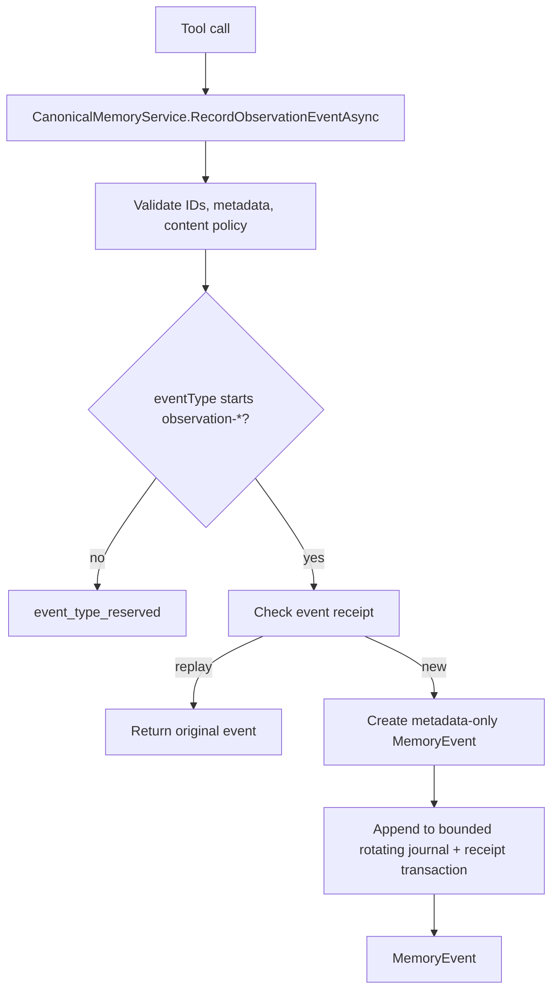
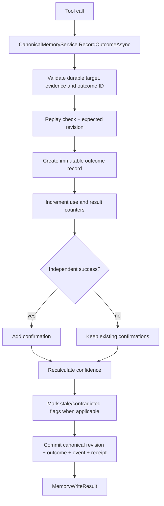
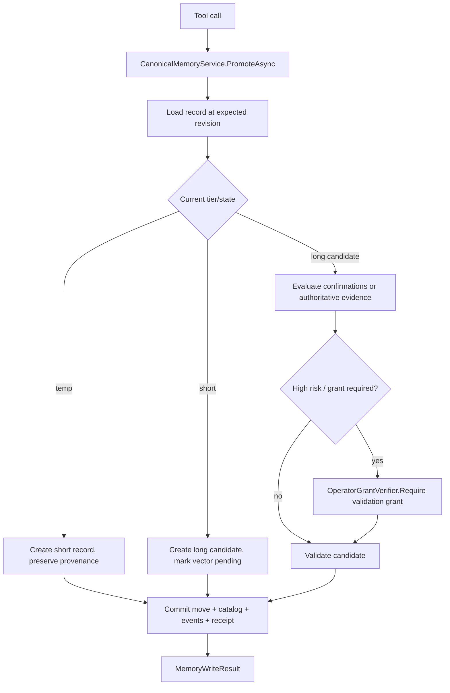
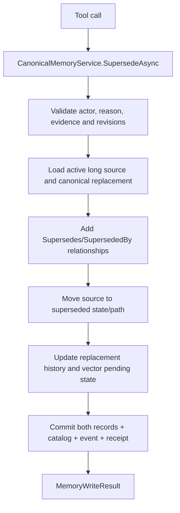
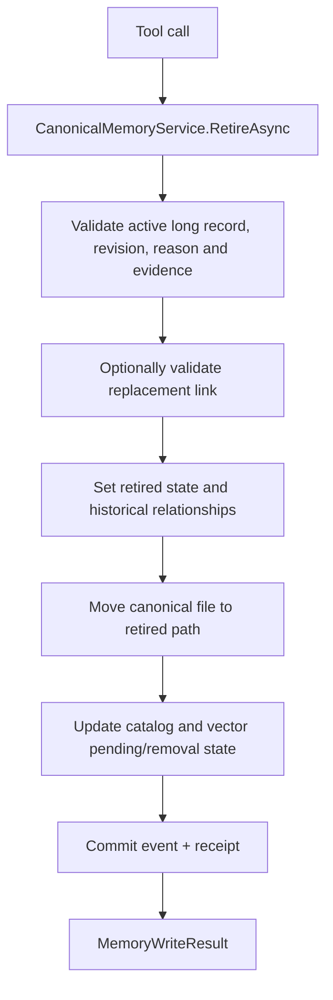

# Learning lifecycle tool end-to-end flows

[Previous: Curation](07-curation-tool-flows.md) | [Developer wiki](README.md) | [Next: Maintenance tools](09-maintenance-tool-flows.md)

## `memory_record_event`

Caller events cannot impersonate authoritative lifecycle events emitted by services.

## `memory_record_outcome`

Confidence is `(1 + successes + 0.5 * partialSuccesses) / (2 + successes + partialSuccesses + failures + contradictions)`.

## `memory_promote`

Promotion never makes advisory memory override current evidence.

## `memory_supersede`

## `memory_retire`

Superseded and retired records disappear from ordinary recall immediately through canonical eligibility checks, even if a stale Qdrant point temporarily remains.

## Lifecycle states

Long-term states include candidate, validated, superseded, retired and rejected. Candidate creation and validation are independent from embedding/index state: semantic outages cannot silently change knowledge status.

