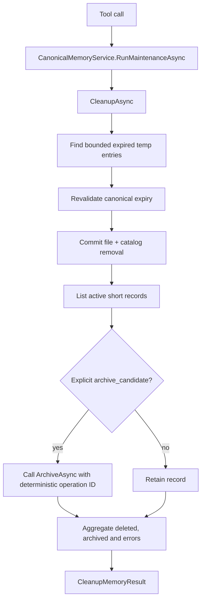
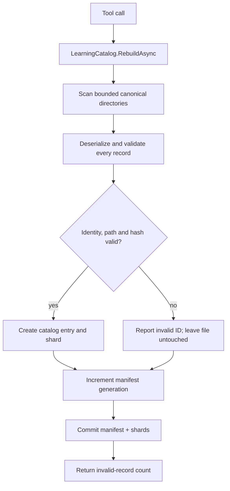
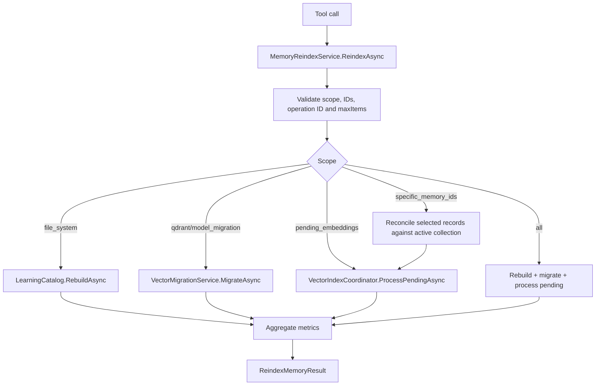

# Maintenance tool end-to-end flows

[Previous: Lifecycle tools](08-learning-lifecycle-tool-flows.md) | [Developer wiki](README.md) | [Next: Semantic pipeline](10-semantic-pipeline.md)

## `memory_cleanup`

Age creates suggestions elsewhere; only an explicit archive-candidate review state is processed automatically.

## `memory_rebuild_indexes`

This tool does not touch embeddings or Qdrant.

## `memory_reindex`

`MemoryReindexScope` values are file system, Qdrant, pending embeddings, specific memory IDs, model migration and all. Model migration retains the previous collection.

## Maintenance ownership

Manual tools are bounded and cancellable. `MemoryMaintenanceService` uses the same underlying services on a periodic ten-second budget; it never invents semantic content or validates candidates.

