# Semantic pipeline: Ollama and Qdrant

[Previous: Maintenance tools](09-maintenance-tool-flows.md) | [Developer wiki](README.md) | [Next: Domain models](11-domain-models-and-contracts.md)

## Purpose

Semantic recall finds paraphrased long-term learning while preserving canonical files as the source of truth. Only long-term records are embedded automatically. Temp and short memory remain filesystem/lexical data.

## Deterministic projection

`EmbeddingProjection.Project` creates normalized text from projection version, title, category, decision area, sorted tags, content and canonicalized structured data. The explicit projection version prevents a code change in embedding input from silently mixing incompatible vectors.

`EmbeddingProjection.Fingerprint` hashes provider, model, model digest, dimension and projection version. Same-dimensional models still produce different fingerprints.

## Ollama adapter

`OllamaEmbeddingClient.GetModelIdentityAsync` reads `api/tags` and binds the configured model to its digest. `EmbedAsync`:

- enforces batch and byte limits;
- reruns content policy before external processing;
- calls loopback `api/embed` with `truncate=false`;
- optionally requires an exact dimension;
- validates model name, result count, dimensions and finite floats;
- distinguishes caller cancellation from provider timeout.

Disabling truncation prevents silently embedding an incomplete record.

## Qdrant representation

`QdrantVectorIndex` creates one deterministic UUID-shaped point ID from repository ID and memory ID. A point contains the vector plus payload fields for repository, memory ID, revision, lifecycle status, content hash, category, decision area, tags, source type, confidence, timestamps and embedding fingerprint.

Payload indexes support repository and metadata filtering before results return. The index stores no authoritative content.

```mermaid
flowchart LR
    A[Canonical long record] --> B[EmbeddingProjection.Project]
    B --> C[OllamaEmbeddingClient.EmbedAsync]
    C --> D[Fingerprint + vector]
    D --> E[QdrantVectorIndex.UpsertAsync]
    E --> F[Vector point + metadata payload]
    F --> G[Search hit ID/revision/hash/score]
    G --> H[Reload and verify canonical record]
    H --> I[Advisory recall result]
```

## Pending work and reconciliation

Canonical mutations can queue `VectorPendingWork`. `VectorIndexCoordinator.ProcessPendingAsync` validates the current record and projection, embeds it, upserts with expected indexed revision and updates canonical embedding/index metadata. Failures are deferred with bounded backoff rather than losing the canonical record.

`ReconcileAsync` compares canonical long records with point states, queues missing/stale work and removes repository-scoped orphan points. Selected-ID reconciliation supports targeted repair.

## Collection naming and migration

`EmbeddingProjection.Collection` produces:

- a stable repository alias based on collection prefix and repository ID;
- a physical collection name containing a fingerprint prefix.

`VectorMigrationService.MigrateAsync`:

1. Discovers model identity and dimensions.
2. Creates a compatible target collection.
3. Persists a migration intent.
4. Builds from a stable catalog snapshot.
5. Replays concurrent canonical changes until stable.
6. Removes target orphans and verifies every current long record.
7. Atomically switches the Qdrant alias.
8. Persists active/previous collection metadata and completes the intent.

`RecoverAsync` resumes a crash after the alias switch. The previous physical collection is retained for rollback.

## Query path

Semantic recall loads the active identity, checks its fingerprint against the configured model, embeds the query, applies repository/lifecycle/metadata filters, requests a bounded set of Qdrant hits, then verifies each hit's current canonical revision, content hash and eligibility. Stale or forged payloads cannot become returned memory.

## Degraded mode

If Ollama, Qdrant, model identity or active collection is unavailable, canonical records remain unchanged. Recall returns labeled lexical results where eligible and includes structured health reasons. No semantic score is fabricated.

## Relevant files

- [EmbeddingProjection.cs](../../AgentSession.MCP/Services/EmbeddingProjection.cs)
- [OllamaEmbeddingClient.cs](../../AgentSession.MCP/Services/OllamaEmbeddingClient.cs)
- [QdrantVectorIndex.cs](../../AgentSession.MCP/Services/QdrantVectorIndex.cs)
- [VectorIndexCoordinator.cs](../../AgentSession.MCP/Services/VectorIndexCoordinator.cs)
- [VectorMigrationService.cs](../../AgentSession.MCP/Services/VectorMigrationService.cs)
- [MemoryReindexService.cs](../../AgentSession.MCP/Services/MemoryReindexService.cs)

