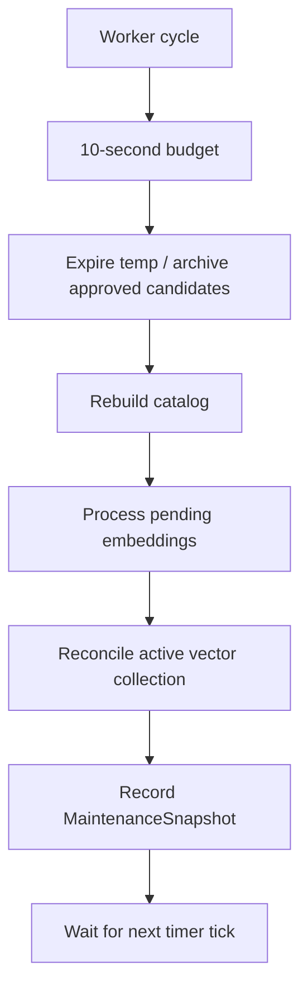

# Hosted maintenance and status

[Previous: Security](12-security-and-trust-boundaries.md) | [Developer wiki](README.md) | [Next: Testing](14-testing-and-acceptance.md)

## Background worker

`MemoryMaintenanceService` extends `BackgroundService`. It runs immediately, then on `Temp.CleanupIntervalMinutes` using `PeriodicTimer` and the injected `TimeProvider`.

Each cycle has a ten-second linked cancellation budget:

1. Run bounded expiry and explicitly approved archive-candidate maintenance until a batch is not full or the budget ends.
2. Rebuild the filesystem catalog from canonical records.
3. Process bounded pending embedding work; degrade on provider errors.
4. If an active collection exists, reconcile canonical and Qdrant state.
5. Record counts, timestamps and a safe error code in `MemoryMaintenanceState`.

The worker does not summarize records, resolve contradictions, promote candidates or delete uncertain durable knowledge.

## Maintenance state

`MemoryMaintenanceState` protects one immutable `MaintenanceSnapshot` with a small lock. It records last cleanup/index/embedding/reconciliation times and latest counts for deletion, archive, processed/indexed/queued vectors, removed orphans and errors.

This state is process-local observability; canonical state remains on disk.

## Status service

`MemoryStatusService.GetAsync` combines:

- canonical tier/lifecycle/review/pending counts;
- transaction recovery backlog;
- latest hosted-maintenance snapshot;
- Ollama model identity/health;
- active vector identity and Qdrant readiness;
- server version and configured roots.

It maps provider timeouts, unavailable services, malformed responses, missing collections and index incompatibility into safe dependency states. It does not return memory content.

## Shutdown

The Generic Host passes `stoppingToken`. A cancellation caused by host shutdown exits cleanly. A per-cycle budget cancellation records `maintenance_budget_exceeded` and allows a later cycle to retry.

## Operational implication

Manual tools and background maintenance share the same locks, transaction store and services. There is no privileged hidden write path, which keeps recovery and concurrency behavior consistent.

