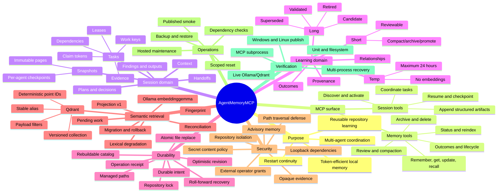

# Project mind map

[Previous: Build and demo](20-build-run-and-demo.md) | [Developer wiki](README.md) | [Next: Glossary](22-glossary.md)

## How to use the map

Start at a requested behavior and follow downward to its domain, durability and verification branches. For example, “semantic recall returned a stale item” crosses learning lifecycle, Qdrant payload, canonical hit verification, reconciliation and the live vector test suite.

