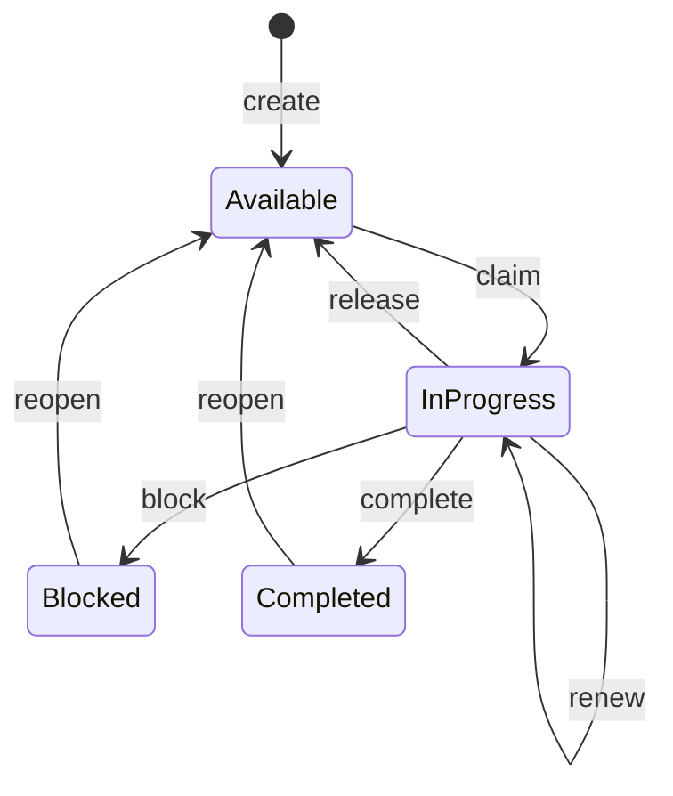

# Multi-agent task coordination

[Wiki index](README.md)

Use `coordinate_agent_task` for every authoritative task transition. Artifact fields may describe work, but only coordinated tasks enforce revisions, dependencies, claims, leases and stale-owner rejection.

## Task lifecycle



Actions are `create`, `claim`, `renew`, `release`, `block`, `complete` and `reopen`. Completed or blocked tasks do not become claimable again until an explicit, reasoned reopen.

## Create stable work

```json
{
  "sessionId": "payments-migration",
  "actorId": "lead-agent",
  "operationId": "create-webhook-tests",
  "taskId": "webhook-tests",
  "action": "create",
  "expectedRevision": 0,
  "workKey": "payments/webhooks/dual-signature-tests",
  "title": "Verify both webhook signatures",
  "dependencies": ["dual-signature-implementation"],
  "acceptanceExpectations": [
    "Old signature passes",
    "New signature passes",
    "Invalid signatures fail"
  ],
  "nextAction": "Claim after implementation completes"
}
```

`workKey` prevents duplicate delegation. Repeating the same definition resolves to the same work; a conflicting definition must be reconciled rather than silently merged.

## Claim and preserve the fencing token

```json
{
  "sessionId": "payments-migration",
  "actorId": "test-agent",
  "operationId": "claim-webhook-tests-test-agent",
  "taskId": "webhook-tests",
  "action": "claim",
  "expectedRevision": 1
}
```

The result returns `claimToken`, `fencingGeneration` and `claimExpiresAtUtc`. The owner must use the current unexpired token for renew, release, block and complete. Check ownership again immediately before external side effects because the server cannot fence file edits, deployments or third-party tools.

## Complete with evidence

```json
{
  "sessionId": "payments-migration",
  "actorId": "test-agent",
  "operationId": "complete-webhook-tests",
  "taskId": "webhook-tests",
  "action": "complete",
  "expectedRevision": 2,
  "claimToken": "token-returned-by-claim",
  "outputs": ["artifact:output-webhook-test-report"],
  "evidence": ["trx:webhook-tests-20260927"],
  "verificationStatus": "passed",
  "handoff": "All dual-signature cases pass; reviewer can inspect the linked TRX report."
}
```

Allowed verification values are `unverified`, `passed`, `failed` and `partial`. Any claim beyond `unverified` requires evidence. The server records the report; it does not execute or independently verify the test.

## Parent-agent practice

A parent agent should:

1. Resume before decomposition.
2. Create tasks with non-overlapping scopes, dependencies and acceptance expectations.
3. Let children claim rather than assigning ownership only in prose.
4. Resume after child completion and reuse their outputs.
5. Reconcile partial or failed verification rather than assuming completion means success.

## Child-agent practice

A child agent should:

1. Resume the shared session and inspect task prerequisites.
2. Claim the task and keep the token out of unrelated artifacts.
3. Renew before lease expiry for long work.
4. Save task-linked findings/outputs using the claim token.
5. Complete, block or release explicitly before stopping.

## Real-life example: two agents race for the same migration

Two executors start from separate chats and both see `migrate-customer-table` as available. Both submit a claim against revision 1. One receives the lease; the other receives the current ownership/conflict information and chooses another task. If the first agent disappears and its lease expires, the second explicitly claims again and gets a new fencing token. A late completion from the original token is rejected, preventing stale ownership from changing the task state.

